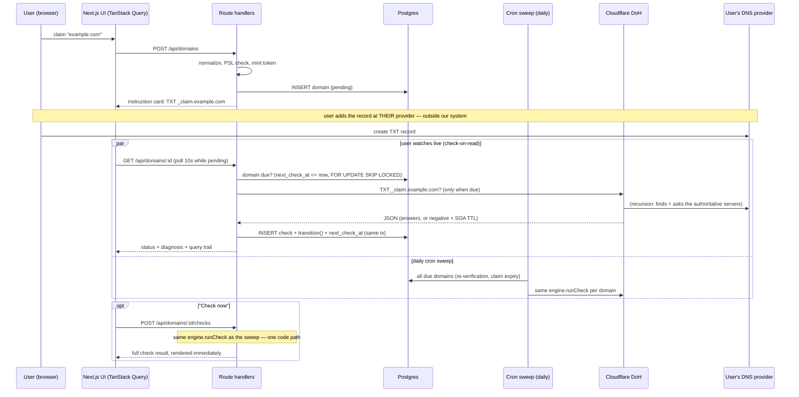

# SPEC — build contract

Types, the diagnosis decision ladder, lifecycle machine, sweep mechanics, API
surface, and schema. If code and this file disagree, one of them is wrong —
fix whichever it is, in the same PR.

---

## 1. Layout & environments

```
.
├── app/                        # Next.js 16 App Router
│   ├── (ui)/                   # pages: domains list, domain detail
│   └── api/                    # route handlers (§7)
├── lib/
│   ├── dns/
│   │   ├── types.ts            # QueryOutcome, TxtRecord, Resolver
│   │   ├── doh.ts              # Cloudflare (primary) + Google (failover) DoH adapters
│   │   └── provider.ts         # NS lookup → provider detection
│   ├── verification/
│   │   ├── codes.ts            # diagnosis registry (the contract)
│   │   ├── diagnose.ts         # pure: outcome(s) -> Diagnosis
│   │   ├── engine.ts           # one check: query, probe, diagnose, persist
│   │   ├── machine.ts          # lifecycle transition function
│   │   └── token.ts            # mint + compare
│   ├── db/                     # drizzle schema + queries
│   ├── sweep.ts                # runDueChecks(limit) — shared by on-read + cron
│   └── env.ts                  # zod-validated env, imported for side effect at boot
└── app/api/cron/sweep/route.ts # daily Vercel Cron target (secret-guarded)
```

Local: `pnpm i && pnpm db:migrate && pnpm dev` with `DATABASE_URL` in `.env`
pointing at Neon (a dev branch or the same database) — no Docker anywhere.

Deployment: Vercel, with **Neon Postgres via the Vercel Marketplace
integration** — provisioning it auto-injects `DATABASE_URL`. Migrations run
from CI or locally against Neon (`pnpm db:migrate`), never inside the Vercel
build. `vercel.json` declares the cron: daily hit to `/api/cron/sweep`,
guarded by `CRON_SECRET` (Vercel sets the header; the route rejects without it).

Pins: Drizzle stable 0.44.x (v1 is at RC; pinned deliberately). Biome. pnpm.

## 2. Core types

```ts
// lib/dns/types.ts
export type QueryOutcome =
  | { kind: 'answered'; records: TxtRecord[]; ttl: number }   // ≥1 TXT answer (type 16 only)
  | { kind: 'nodata';   negativeTtl: number | null }          // Status 0, zero TXT answers
  | { kind: 'nxdomain'; negativeTtl: number | null }          // Status 3
  | { kind: 'error';    reason: 'timeout' | 'servfail' | 'network' | 'malformed' }

export interface TxtRecord { value: string }  // presentation format decoded (§3.5)
export interface Resolver {
  readonly name: string
  query(name: string, type: 'TXT' | 'NS'): Promise<QueryOutcome>
}
// The engine takes resolvers: Resolver[] — Cloudflare primary, Google failover.
// Google is queried only when Cloudflare returns kind:'error', so a resolver
// outage stops being a user-visible DNS_UNREACHABLE. Diagnosis is unchanged:
// exactly one outcome reaches the ladder. Consensus is a further step (§12).
```

Outcomes are values, never throws. `nodata` and `nxdomain` are different facts
(the name exists without TXT records vs the name does not exist) and produce
different diagnoses. `negativeTtl` is read from the Authority section's SOA
record `TTL` field — the effective remaining negative-cache lifetime (RFC 2308).

```ts
// lib/verification/codes.ts
export const DiagnosisCode = {
  VERIFIED_OK: 'VERIFIED_OK',
  TOKEN_MISMATCH: 'TOKEN_MISMATCH',
  ZONE_NAME_APPENDED: 'ZONE_NAME_APPENDED',
  RECORD_NOT_FOUND: 'RECORD_NOT_FOUND',
  RECORD_NAME_MISSING: 'RECORD_NAME_MISSING',
  DNS_UNREACHABLE: 'DNS_UNREACHABLE',
} as const
export type Verdict = 'pass' | 'fail' | 'indeterminate'

export interface DiagnosisDefinition {
  readonly code: DiagnosisCode
  readonly verdict: Verdict
  readonly summary: string          // a sentence a support reply could reuse
  readonly action: string | null    // the one thing the user should do; null = wait/done
}
export const REGISTRY: Readonly<Record<DiagnosisCode, DiagnosisDefinition>> = { /* exhaustive */ }
```

`warn` is deliberately absent from the verdict set: with a single required
record, nothing is simultaneously acceptable and concerning. It would arrive
with multi-record checks (SPF/DKIM) if built.

## 3. The check procedure

### 3.0 The whole loop

No third-party verification service. The one external dependency is public DNS,
read via Cloudflare's free, keyless DoH endpoint. Verification is a `fetch`, a
JSON parse, and a string compare. We never touch the user's zone — that
inability is the security property: only someone who can edit the domain's DNS
can complete the loop.



### 3.1 Steps of one check (`engine.runCheck(domain, trigger)` — identical for manual and sweep)

1. **Primary query**: TXT `_claim.<name>`, `AbortSignal.timeout(3000)`.
2. **Conditional probe**: if no record matches the token, query TXT
   `_claim.<name>.<name>` (the doubled name). Lookup `purpose`: "probing for a
   provider-appended zone name".
3. **Diagnose** (§3.2, pure function).
4. **Persist**: INSERT `checks` row + apply `transition()` in one DB transaction.

### 3.2 The decision ladder

Evaluated top-down; first rule wins. The organizing principle: report the most
specific thing we can say, keyed to the user's next action.

| # | Rule | Code | Verdict | Meaning |
|---|---|---|---|---|
| 1 | a TXT at `_claim.<name>` equals the token | `VERIFIED_OK` | pass | Done |
| 2 | probe found the token at the doubled name | `ZONE_NAME_APPENDED` | fail | Provider appended the domain — put just `_claim` in the host field. Evidence: both names, rendered as a diff |
| 3 | TXT records exist, none match | `TOKEN_MISMATCH` | fail | Stale token or mangled paste. Evidence: expected vs found |
| 4 | nxdomain | `RECORD_NAME_MISSING` | fail | The name was never created — check the host field |
| 5 | nodata | `RECORD_NOT_FOUND` | fail | Not added yet, or absence still cached (§3.4) |
| 6 | error | `DNS_UNREACHABLE` | indeterminate | We couldn't look. Says nothing about the record; never rendered as failure |

Precedence: a match beats everything; `appended` beats `mismatch` (the
doubled-name fix is the real fix even if a stale value also exists);
evidence of a wrong act beats absence; `nxdomain` beats `nodata` (the more
specific absence).

### 3.3 Verdict semantics

`fail` means "the record is not correctly in place right now" — for a `pending`
domain that is the *expected* state, and the UI renders it as setup-in-progress,
not alarm. Verdict = what we know; lifecycle = what we do; UI tone = where the
user is in their journey. Three layers, deliberately separate.

### 3.4 Negative-cache advisory

Attached as a note to `RECORD_NOT_FOUND`/`RECORD_NAME_MISSING` when the observed
`negativeTtl` exceeds 300s and the claim is younger than 2× that TTL: "A
resolver may remember this record's absence for up to ~N minutes after you add
it. Nothing is wrong on your end." Never changes the code or verdict. (300s is
a guess; the comment names the measurement that would justify it: the
distribution of SOA minimums across common providers.)

### 3.5 DoH parsing rules (each is a documented real-world pitfall)

- Header `accept: application/dns-json` is mandatory (400 without it).
- Filter `Answer` to `type === 16` before classifying — CNAME entries (type 5)
  ride along, even inside Status-3 responses. `Answer` may be absent entirely.
- Cloudflare TXT `data` is quote-wrapped with presentation-format escaping:
  strip outer quotes per chunk, unescape `\"` and `\\`, join chunks. Small
  parser, unit-tested against captured real responses; it lives inside the
  adapter (a different resolver's endpoint returns a different encoding —
  normalization is per-adapter by design).
- Response `name` fields carry trailing dots — normalize before the
  doubled-name comparison.
- NXDOMAIN = `Status: 3`; NODATA = `Status: 0` with zero TXT answers;
  SERVFAIL = `Status: 2`.
- The try/catch around this one fetch is where all `{kind:'error'}` values are
  born: abort → `timeout`, socket failure → `network`, non-OK HTTP or
  unparseable body → `malformed`, Status 2 → `servfail`. Nothing else in the
  codebase try/catches DNS.

## 4. Token

- Mint: `crypto.randomBytes(16)` → base32 lowercase (hand-rolled ~10-line
  encoder or the zero-dep `rfc4648` package; Node has no built-in base32) → 26
  chars. 128 bits of entropy.
- Record value: `verify=<token>`. The convention is a product-prefixed value
  (`google-site-verification=`, `vercel-domain-verify=`); the product is named
  Verify, so `verify=` is the prefix. Record name `_claim.<domain>` — you claim
  the domain at `_claim`, and prove it with `verify=`.
- Compare: sha256 both sides, then `crypto.timingSafeEqual` (it throws on
  unequal lengths; hashing first sidesteps that). Honest note: the token is
  public in DNS, so timing-safety here is hygiene, not a defense.
- One token per (domain, claim); reclaiming mints a fresh token and the old one
  can never verify again (dangling-record hygiene). Stored plaintext: the token
  is public the moment it lands in DNS and grants nothing beyond this one
  verification — hashing it would only prevent re-showing the instruction card.

## 5. Lifecycle machine

Core: 3 states (`pending`, `verified`, `expired`). Stretch: `temporarily_failed`
and `revoked` with hysteresis. **All 5 enum values ship in the first migration**
regardless — adding Postgres enum values later is its own migration; shipping
values without transitions is the cheap seam.

```ts
type Event =
  | { type: 'check'; trigger: 'manual' | 'sweep'; verdict: Verdict }
  | { type: 'claim_ttl_elapsed' } | { type: 'grace_elapsed' } | { type: 'reclaim' }
function transition(d: DomainSnapshot, e: Event): TransitionResult  // pure; caller persists
```

| State | Event | Next | Effects |
|---|---|---|---|
| pending | check pass | **verified** | set verified_at, next_check_at = +24h |
| pending | check fail/indeterminate | pending | schedule per backoff (§6) |
| pending | claim_ttl_elapsed (72h) | **expired** | next_check_at = FAR_FUTURE |
| verified | check pass | verified | next_check_at = +24h |
| verified | check fail/indeterminate | verified | core: no demotion path (hysteresis is the stretch) |
| expired | reclaim | **pending** | new token, reset |

Stretch rows (hysteresis): verified + **sweep** fail → counter+1; ≥3 consecutive
→ `temporarily_failed` (set failing_since, banner). Manual check failures never
increment the counter — a user hammering "Check now" during their own
nameserver outage must not accelerate their demotion, and thresholds are
meaningless if a manual burst can feed them. `temporarily_failed` + pass →
verified; + grace_elapsed (72h) → `revoked`; `revoked` + reclaim → pending.
Promotion can happen on any check; demotion only through scheduled sweep
evidence. The 3-consecutive threshold and both 72h windows are stated guesses;
72h matches the detection/recovery windows published by major providers.

`transition()` is the only place status changes; it returns `{from, to, reason}`
as data — the seam where webhooks or notifications would attach.

## 6. Scheduling (serverless: check-on-read + daily cron)

There is no resident process on Vercel, so checks run where the platform gives
us execution time:

**Check-on-read.** `GET /api/domains/:id` (which the UI polls every 10s while
pending) first runs a due check inline: one short transaction claims the row
(`SELECT … FOR UPDATE SKIP LOCKED` where `next_check_at <= now()`), then
`runCheck(domain, 'sweep')` → INSERT check + `transition()` + new
`next_check_at`, commit, respond with the fresh state. Not due or locked →
respond with stored state. The user watching the screen IS the scheduler,
exactly when checking matters most. SKIP LOCKED is what makes two overlapping
poll requests (two tabs, double-render) run one check, not two.

**Daily cron.** `vercel.json` schedules `/api/cron/sweep` once a day (the
Hobby-plan maximum, and all the unattended work needs): it loops
`runDueChecks` over every due domain — re-verifying `verified` domains,
expiring stale claims via `claim_ttl_elapsed`, advancing grace windows. Same
`runCheck`, same transaction shape; secret-guarded via `CRON_SECRET`.

- Crash mid-check → the lock releases, the row is still due, the next poll or
  cron run retries. At-least-once with idempotent effect: re-running a check
  is just a check.
- Time-based events (claim TTL, grace) are evaluated inside `runDueChecks`
  from `claimed_at` / `failing_since` — no separate timers to drift.
- `FAR_FUTURE = new Date('9999-01-01T00:00:00Z')` — a named constant, not SQL
  `'infinity'` (drivers parse infinity to the JS number `Infinity`, which
  breaks Drizzle's date mode). Preserves the invariant that `next_check_at`
  is never NULL.
- Trigger vocabulary: `'manual'` = the Check-now button; `'sweep'` = any
  system-initiated check (on-read due check or cron). The hysteresis
  asymmetry (§5) counts only `'sweep'` failures.

Due-cadence while watched: pending <15m → every 30s; 15m–2h → 5m; 2h–72h → 1h;
verified → 24h; temporarily_failed → 1h. A pending domain nobody is watching
simply waits — pending only matters during setup, and the daily cron still
catches expiry. This is attention-adaptive scheduling, stated plainly in the
README; a resident sweeper is the named at-scale evolution (`lib/sweep.ts` is
already the module a worker would import).

Honest consequence to keep true in copy: the UI says "We check every 30
seconds while you're here, and daily once verified" — which is exactly what
happens.

Manual "Check now": 5 per domain per 5 minutes, implemented as a `COUNT(*)`
over recent `checks` rows (correct across processes; no in-memory counters).
429 carries `retry_after`; the UI shows "checked just now" with a countdown on
hover — never a disabled gray mystery.

## 7. API surface

`{ data, error, meta }` envelope; zod `safeParse` at every boundary; validation
errors name the failing field. There is no session or account layer — the
domain list is global to the deployment. See DECISIONS.md for why that is
deliberate and where auth would attach.

| Route | Purpose | Notes |
|---|---|---|
| POST /api/domains | claim | normalize → validate (tldts PSL, IDN) → mint token. 201; 409 on duplicate |
| GET /api/domains | list | |
| GET /api/domains/:id | detail + latest check | the detail page's one query |
| GET /api/domains/:id/checks | timeline | LIMIT 50 |
| POST /api/domains/:id/checks | interactive check | 201 full check; 429 + retry_after |
| POST /api/domains/:id/reclaim | restart after expired/revoked | UI verb: "Restart verification" |
| DELETE /api/domains/:id | hard delete | confirm copy reminds: the TXT record stays in their DNS |
| GET /api/health | ops | reports last cron run + last check timestamps — proves the schedule is alive |
| GET /api/cron/sweep | daily sweep | Vercel Cron only; 401 without the CRON_SECRET header |

Next 16 notes: route `params` is a `Promise<{id}>`.

## 8. Schema

`{ withTimezone: true }` on every timestamp column — grep before the first
migration. uuidv7 PKs via the `uuidv7` package (`$defaultFn`).

```
domains: {
  id uuidv7 PK,                 // uuid column type; minted app-side (Postgres is v4-only)
  name text UNIQUE,             // normalized: lowercase, punycode via url.domainToASCII
                                // (strip the trailing dot FIRST; '' return = invalid)
  token text, status domain_status,   // all 5 enum values in migration 1
  consecutive_failures int default 0,
  next_check_at timestamptz NOT NULL, // never NULL; terminal states use FAR_FUTURE
  claimed_at, verified_at?, failing_since?, last_checked_at?, expires_at
}
checks: {
  id uuidv7 PK, domain_id -> domains cascade,
  trigger enum(manual, sweep), started_at, finished_at,
  lookups jsonb,                // Lookup[]: {name, purpose, outcome, latencyMs}
  verdict enum, diagnosis_code text, evidence jsonb, notes jsonb
}
-- indexes: domains (next_check_at) WHERE status IN (...) ; checks (domain_id, started_at desc)
```

Driver: Neon's serverless driver (`@neondatabase/serverless`) with
`drizzle-orm/neon-http` for single queries; use the driver's websocket/session
mode for the transactions that need `FOR UPDATE SKIP LOCKED` (the HTTP mode is
per-statement and can't hold a lock). Dev note: keep any client/pool on
`globalThis` in development so HMR doesn't leak connections per reload.

## 9. Demo strategy

Real DNS only — no simulated mode. Anyone can experience the real path without
owning a domain: add `google.com` and watch a real query return a real
`RECORD_NOT_FOUND` with a real trail (latency, TTLs). The README walkthrough
leads with that step; a screenshot gallery covers the states that require a
misconfigured domain to produce (captured with a domain we control); the demo
video shows a real domain verified end-to-end. Provider detection (one NS
query) auto-opens the matching provider's setup accordion.

## 10. Testing

- `diagnose.spec.ts` — every ladder rule + negative assertions ("appended is
  not reported as merely missing"; "a timeout is never a failed verification").
- `machine.spec.ts` — every transition including named no-ops ("a manual check
  failure does not increment the counter").
- `doh.spec.ts` — the TXT parser against captured real responses (quoted,
  escaped, multi-chunk, CNAME-polluted, absent-Answer).
- `token.spec.ts`, `normalize.spec.ts` (IDN, trailing dots, PSL table).
- Named non-goal: integration tests against real authoritative fixture zones —
  the gold standard for this engine and the first post-submission addition.

## 11. Deliberately out

DoH response caching (a verification product wants fresh answers), retries
within a check (the schedule is the retry mechanism), queue infrastructure
(Postgres `next_check_at` + SKIP LOCKED is the queue at this scale), timeline
pagination, soft delete, accounts and sessions (see DECISIONS.md).

## 12. Designed extension: multi-resolver consensus

Two resolvers already ship, but as **failover, not consensus** (§2): Google is
queried only when Cloudflare errors, so exactly one outcome reaches the ladder
and no diagnosis changes. Consensus is the next step and is not built.

Under consensus, each resolver's outcome classifies independently and a merge
ladder replaces §3.2: both match → pass; exactly one
match → a new `PROPAGATION_IN_PROGRESS` code (indeterminate — the record
demonstrably exists, the write hasn't stabilized); otherwise the existing
ladder over the most specific non-match signal, with both-error →
`DNS_UNREACHABLE`. Honest caveat that stays true regardless: two resolvers
queried from one server share an egress IP — that's two cache pools, not two
vantage points. True multi-vantage means checkers in multiple regions, which
is infrastructure, not configuration.
